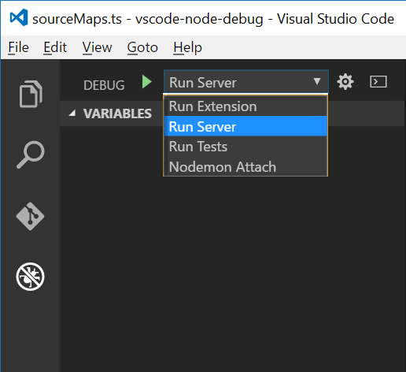

Whilst I managed to solve my Jest issue, poking around the debugger was actually more interesting than the problem I was trying to solve.

Visual Studio Code has a really extensible model for debuggers and you can read about it more here, but to give an overview, VS Code uses debug adapters to talk to underlying debuggers. It communicates with these adapters using the VS Code Debug Protocol (CDP).

The debugger we’ll be looking at here is the node debugger so let’s get the code by running the following commands:
```powershell
git clone git@github.com:Microsoft/vscode-node-debug.git
npm install
```

We also need a project to debug, you can use one of your own or use my boilerplate Jest example:

```powershell
git clone git@github.com:gareth-evans/jest-vscode.git
npm install
```

## Starting the debugger

Open a new instance of VS Code and open the folder where you downloaded vs-node-debug, then in the debug view select Run Server from the drop down, and hit F5. This starts the debugger in server mode listening for connections on port 4711.



## Attaching to the debugger

In another instance of VS Code open jest-vscode (or your own project) then in the launch.json file add “debugServer”: 4711. If you’re using jest-vscode your launch.json should look like this:

```javascript
{
    "version": "0.2.0",
    "debugServer": 4711,
    "configurations": [
        {
            "name": "Debug Tests",
            "type": "node",
            "request": "launch",
            "program": "${workspaceRoot}/node_modules/jest-cli/bin/jest.js",
            "stopOnEntry": false,
            "args": ["--runInBand"],
            "cwd": "${workspaceRoot}",
            "preLaunchTask": "tsc",
            "runtimeExecutable": null,
            "runtimeArgs": [
                "--harmony"
            ],
            "env": {
                "NODE_ENV": "development"
            },
            "externalConsole": false,
            "sourceMaps": true,
            "outDir": null,
            "port": 9070
        }
    ]
}
```

## Setting a breakpoint in the debugger

Depending on what you want to do will determine where you start looking, but as I had problems with source maps not loading so I set a breakpoint in the MapFromSource method in SourceMaps.ts

With the breakpoint set hitting F5 in the jest-vscode/your project window will invoke the debugger and your breakpoint will be hit.